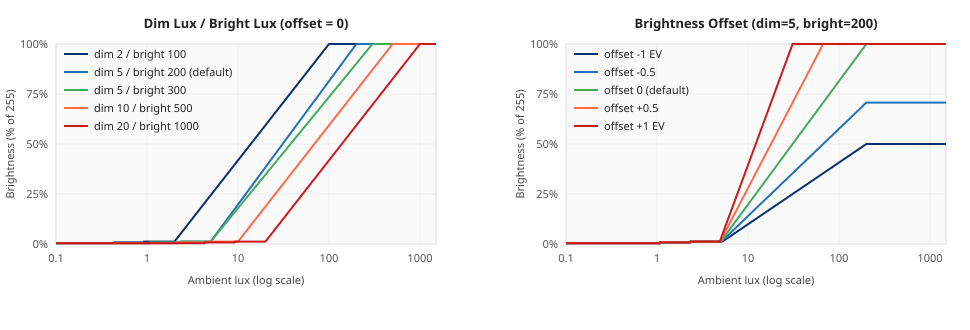
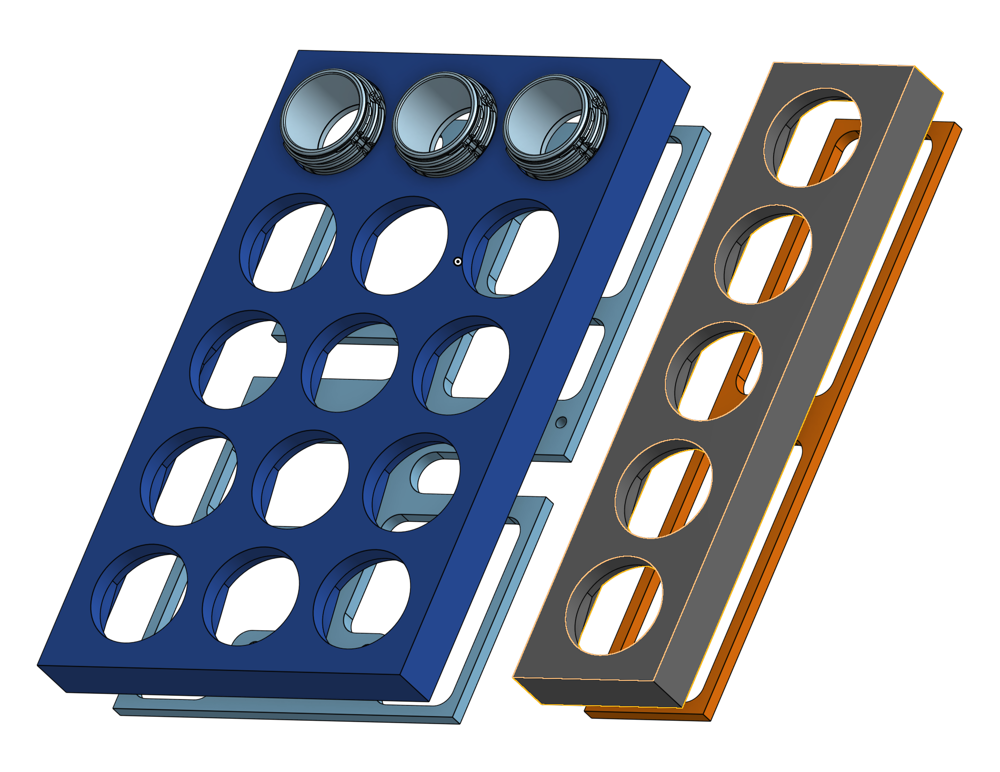
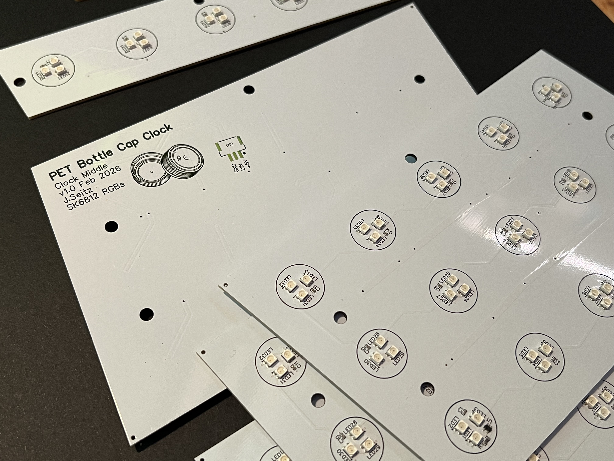

# Bottle Cap Clock

A 4-digit Wi-Fi clock that uses recycled PET bottle caps as diffusers over a
WS2812 LED matrix. Time comes from SNTP, the display is driven by ESPHome on
a custom ESP32-S3 board, and all configuration is exposed through the ESPHome
web UI or Home Assistant. The repo is set up so a kit owner can flash the
provided firmware, provision Wi-Fi from a phone, and have a working clock
with no YAML edits.

The firmware is one ESPHome configuration (`clock.yaml`). It reads the time
from SNTP, renders four 5x3 digits plus a colon onto a 65-cap LED strip
(195 individual LEDs, 3 per cap), and exposes color, brightness, mode and
orientation settings as live entities. Color and brightness are restored
across reboots, and an optional BH1750 ambient-light sensor can drive
brightness automatically.

## Requirements

- Custom Bottle Cap Clock PCB (or compatible ESP32-S3 board with WS2812
  output and the pinout described below)
- 65-cap WS2812 LED strip wired in column-serpentine layout
- 5 V power supply sized for the LEDs (~3 A peak at 100% white; ~0.5 A
  for typical clock content). USB power is enough for flashing only.
- BH1750 ambient light sensor on I2C (optional, only needed for the
  Auto Brightness feature)
- Python 3.9+ if you want to flash from the command line

## Quick start

The recommended flow uses the [ESPHome web installer](https://esphome.io/guides/getting_started_command_line.html)
or your existing ESPHome / Home Assistant dashboard. No YAML editing needed.

1. Plug the board into USB.
2. From the ESPHome dashboard click **Adopt** on the new device, or use the
   ESPHome web tools to flash this repository's `clock.yaml`.
3. After the first flash the clock starts a Wi-Fi access point named
   `Bottle Cap Clock`. Connect a phone to it and complete the captive
   portal, or use any Improv-compatible client to send credentials over
   USB serial / BLE.
4. The clock joins your network, picks up the time from SNTP, and shows
   the current `HH:MM` in the user-selected color.

### Flashing from the command line

If you prefer the CLI:

```bash
./setup.sh                # creates venv/ and installs esphome
source venv/bin/activate
esphome run clock.yaml
```

After the first USB flash, subsequent updates are delivered over the air
through the ESPHome dashboard.

## Configuration

All user-facing settings live in the web UI (and mirror to Home Assistant):

| Entity | Type | Description |
|--------|------|-------------|
| Clock LEDs | light | Master on/off, color, brightness. Color is also used as the base color for all clock modes. |
| Clock Mode | select | `Mono`, `Rainbow`, `Bicolor`, `Waves`. Persists across reboots. |
| Rotate 180 | switch | Flips the display for upside-down mounting. |
| Auto Brightness | switch | Drives brightness from the BH1750 lux reading. |
| Brightness Bias | number | Make-up gain on the auto-brightness curve (0.5..3.0). Doubles brightness across the whole curve when doubled. |
| Saturation Lux | number | Lux at which the curve reaches max brightness (50..2000). Lower = clock saturates earlier; higher = stretched response for bright rooms. |
| Max Brightness | number | Hard cap on the light output (0.30..1.00). Applies to manual and auto control. |
| Ambient Light | sensor | Raw lux reading from the BH1750. |
| User Button | binary_sensor | The button on the back of the board. Not bound to anything by default. |

For deeper changes (timezone, GPIO assignments, project name) edit the
`substitutions:` block at the top of `clock.yaml`.

### Auto-brightness curve

When **Auto Brightness** is on, the firmware maps lux from the BH1750 into the
clock's 0..255 brightness on a smooth curve. Two orthogonal controls shape it:

- **Saturation Lux** sets the curve's horizontal scale: it is the lux value
  at which the curve reaches max brightness. Lower values compress the curve
  so the clock saturates earlier (good for permanently dim rooms); higher
  values stretch it (good for sunlit rooms where you want headroom). Above
  Saturation Lux the output stays flat — there is no overshoot.
- **Brightness Bias** is **uniform make-up gain**. It scales the curve up or
  down without changing where it saturates. Doubling the bias roughly doubles
  the brightness at every lux level (until clamped by Max Brightness). It does
  *not* lift the dark-room floor: a pitch-dark room always lands at B=1 (one
  tiny dot per cap) regardless of bias.



The left panel shows how Brightness Bias scales the whole curve up and down
without moving its saturation point. The right panel shows how Saturation
Lux changes where the curve reaches max brightness: lower values pull the
"knee" inward, higher values push it out. Tune the response with the two
sliders rather than editing the lambda.

The curve is gentle at the dim end on purpose. Below ~10 lux only one or two
LEDs per cap are lit, walking through the *sub-pixel ladder* the firmware
exposes:

| HA brightness `B` | Per-cap output |
|---|---|
| 0 | Off |
| 1 | 1 LED at PWM 1 |
| 2 | 2 LEDs at PWM 1 |
| 3 | 3 LEDs at PWM 1 |
| ≥4 | 3 LEDs at PWM `B - 2` |

This extends the dim end of the WS2812's PWM range by three sub-steps that
would otherwise be unreachable.

The Python tests in `tests/test_brightness_mapping.py` mirror this math and
verify the curve, the saturation point, the make-up-gain property of bias,
and the sub-pixel ladder. Re-run them after curve changes:

```bash
python3 tests/test_brightness_mapping.py
```

To regenerate the chart after editing constants:

```bash
python3 tools/plot_brightness_curve.py
```

### Local development with hardcoded Wi-Fi

If you'd rather skip the captive portal during development, replace the
`wifi:` block in `clock.yaml` with:

```yaml
wifi:
  ssid: !secret wifi_ssid
  password: !secret wifi_password
  ap:
    ssid: "${friendly_name}"
```

and copy `secrets.yaml.example` to `secrets.yaml` with your credentials.

## Hardware

Custom ESP32-S3 board (16 MB flash, 2 MB octal PSRAM). Default pinout:

| Pin | Function |
|-----|----------|
| GPIO2 | Heartbeat LED (1 Hz blink) |
| GPIO6 | User button (active low, internal pull-up) |
| GPIO8 | I2C SDA (BH1750) |
| GPIO9 | I2C SCL |
| GPIO16 | WS2812 data line (195 LEDs, 65 caps) |

Each digit is a 5 row x 3 column grid, 15 caps total. The strip is wired
column-serpentine within each digit:

```text
Col:  0   1   2
    +---+---+---+
R0  | 0 | 9 |10 |
R1  | 1 | 8 |11 |
R2  | 2 | 7 |12 |
R3  | 3 | 6 |13 |
R4  | 4 | 5 |14 |
    +---+---+---+
```

Strip layout (65 caps, 195 LEDs):

| Segment | Caps | LEDs |
|---------|------|------|
| Digit 0 (hours tens) | 0-14 | 0-44 |
| Digit 1 (hours units) | 15-29 | 45-89 |
| Colon (5-cap column) | 30-34 | 90-104 |
| Digit 2 (minutes tens) | 35-49 | 105-149 |
| Digit 3 (minutes units) | 50-64 | 150-194 |

The colon lights caps 1 and 3 of its column and fades at 0.5 Hz.

## Project structure

```text
clock.yaml                       Main ESPHome configuration
doc/                             Documentation, diagrams, photos
  esphome-led-best-practices.md  Notes on driver, mapping, persistence
  auto-brightness-curve.svg      Reference chart for the lux curve
tests/test_brightness_mapping.py Verifies the brightness math
tools/plot_brightness_curve.py   Regenerates the SVG chart
secrets.yaml.example             Optional Wi-Fi credentials template
setup.sh                         Creates venv/ and installs esphome
requirements.txt                 Python dependencies (esphome only)
```

If you change the layout or add features, the diagnostic effects in
`clock.yaml` are useful starting points:

- **Cap Walk** lights one cap at a time, logging the cap index. Use it to
  verify the physical wiring matches `ROW_COL_TO_CAP`.
- **Digit Test** cycles 0..9 on all four positions without depending on
  SNTP, useful for verifying the digit bitmap.

Switch to either by selecting it in the **Effect** dropdown of the
**Clock LEDs** light entity.

## Hardware files

The mechanical design (enclosure, cap holder, mounting) lives in Onshape:
[Bottle Cap Clock CAD](https://cad.onshape.com/documents/13c87f5ea3b4b603efd574fc/w/49e84532c6248edc6cce69d9/e/788ae649796e7419da4fe0d6?renderMode=0&uiState=69ef963afc6c58a2478b6e0f).



The PCBs (digit modules, colon module, controller carrier) are custom and
not currently for sale through a shop. If you'd like a set, get in touch at
[@somebox on swiss.social](https://swiss.social/@somebox).



## Contributing

PRs welcome. Things that would be useful:

- Per-minute / per-hour transition animations (plasma wipe, sparkle, etc.)
- Optional 12 h format and AM/PM indicator
- Auto-brightness curve presets (linear, perceptual, night-only)
- Schematic and PCB files for the carrier board

See also `doc/esphome-led-best-practices.md` for the design notes and
lessons learned that inform the firmware (driver choice, pixel mapping,
sub-pixel dimming, sensor smoothing, persistence pitfalls).
